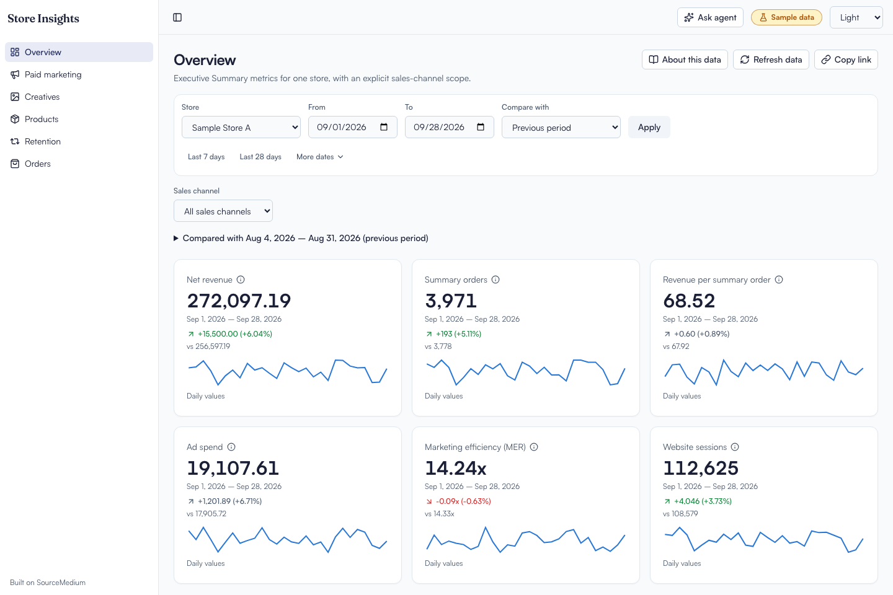
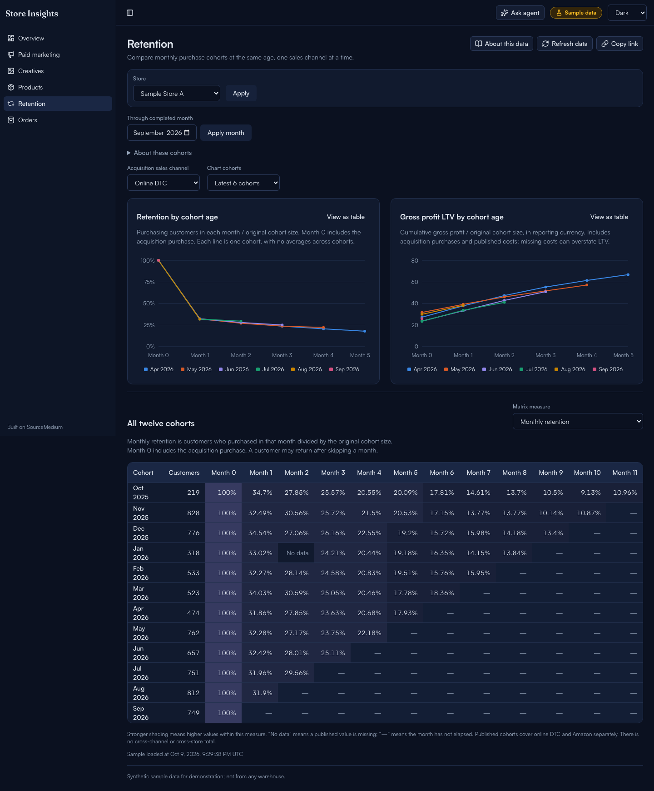
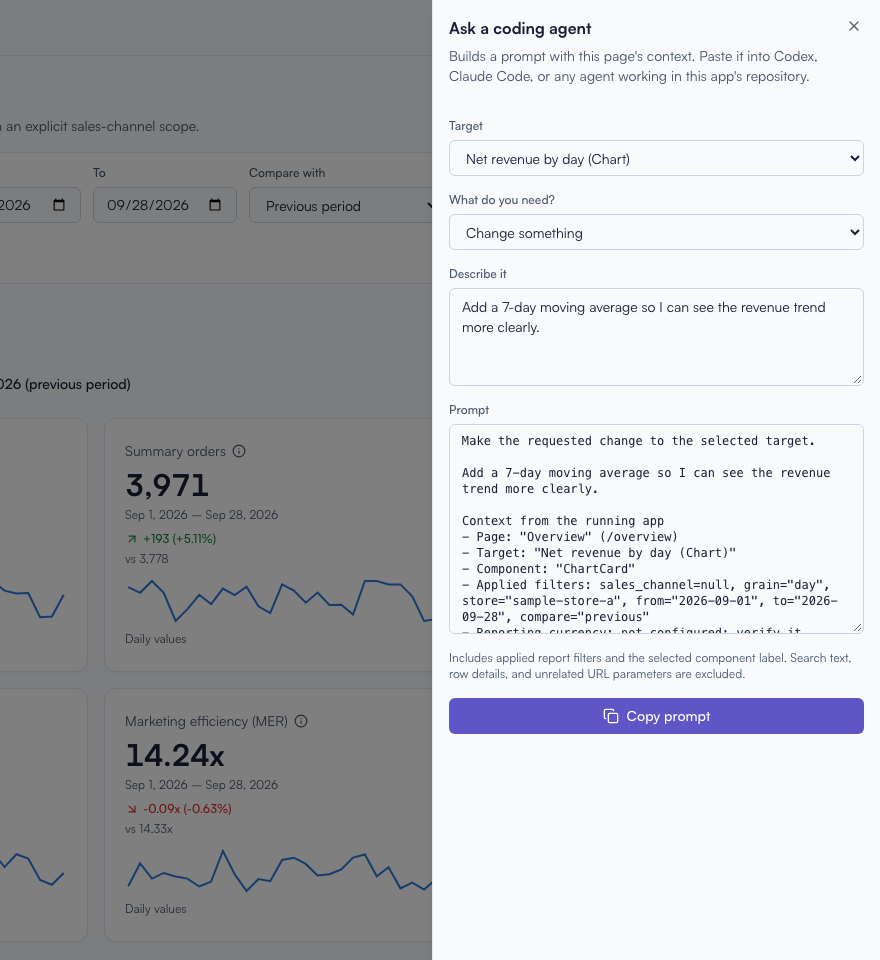

# SourceMedium App Starter

**Your SourceMedium data. An app you own. Built with your coding agent.**

Start with six working reports, connect your warehouse, then tell Codex or
Claude Code what to change. The starter handles the connection, sign-in,
store and date filters, charts, tables, and loading and error states.
You get a normal Next.js app with editable code throughout.

**[Try the demo](https://sm-app-starter-demo.source-medium.workers.dev)** ·
[Use this template](https://github.com/source-medium/sm-app-template/generate) ·
[Start with Codex](docs/cloud.md#codex-cloud) ·
[Start with Claude](docs/cloud.md#claude-code-in-the-cloud)

<picture>
  <source media="(prefers-color-scheme: dark)" srcset="docs/images/overview-dark.png">
  <source media="(prefers-color-scheme: light)" srcset="docs/images/overview-light.png">
  
</picture>

_The hosted demo uses SourceMedium's demo warehouse and requires sign-in ([request access](mailto:support@sourcemedium.com)). These screenshots use synthetic sample data. Light and dark modes are built in._

## Start in your browser

Use **Codex Cloud** or **Claude Code in the cloud**. No local installation needed.

1. [Create your copy](https://github.com/source-medium/sm-app-template/generate).
2. Choose your agent below and paste the [starter message](docs/cloud.md#your-first-message-in-either-agent).
3. Connect your copy to one Cloudflare Worker (Workers Paid, from US$5 a month)
   for the first hosted URL. Then connect your warehouse and a protected preview
   Worker once. Describe a change → review it on your data → approve publication.

| Coding agent                 | Start here                                              |
| ---------------------------- | ------------------------------------------------------- |
| **Codex Cloud**              | [Set up Codex](docs/cloud.md#codex-cloud)               |
| **Claude Code in the cloud** | [Set up Claude](docs/cloud.md#claude-code-in-the-cloud) |

The first look uses labeled **sample data**, with no warehouse credentials.
After connection, previews use your actual data; missing preview settings
show a setup error instead of sample numbers. Your agent runs setup and checks.
Cloudflare Workers Paid hosts the app; GitHub and your
chosen coding agent need access to your repository.

**[Follow the browser setup and preview-to-live guide →](docs/cloud.md)**

## Six reports to make your own

| Report             | Start with                                                      |
| ------------------ | --------------------------------------------------------------- |
| **Overview**       | Revenue, orders, ad spend, trends, and period comparisons       |
| **Paid marketing** | Channel and campaign performance, spend, and return on ad spend |
| **Creatives**      | Creative images and performance cards                           |
| **Products**       | Product and variant rankings                                    |
| **Retention**      | Retention and lifetime value by acquisition cohort              |
| **Orders**         | Searchable orders with detail drawers and pagination            |

Copy the closest view, change its query and presentation, or
[remove the examples](docs/removing-the-example.md). Each view owns its code.

<details>
<summary><strong>See the retention report</strong></summary>



Completed-month windows, acquisition-channel filters, and explicit missing-data
states keep cohort comparisons readable.

</details>

## Prefer local development?

Install Node.js 22.22.1 or newer (CI uses 24) and pnpm 10.34.5 first. Create your
own repository with GitHub's **Use this template**, then clone it and open a
terminal in that folder.

```sh
pnpm install --frozen-lockfile
pnpm dev
```

Open http://127.0.0.1:3000. It runs on clearly labeled **sample data**: no
account, credential, database, or AI service needed.

## Use your data

Live data needs an app configuration block from the **Apps** page of your
SourceMedium workspace. Apps appears in the workspace menu once your data has
been delivered, and an organization admin creates the app. If the page says
credentials are still being enabled, stay on sample data and ask
[SourceMedium support](SUPPORT.md). Do not substitute an admin credential.

For an already provisioned app, follow [docs/connect.md](docs/connect.md).
Cloudflare Workers is the tested runtime.

## Build with your coding agent

Codex and Claude Code share [AGENTS.md](AGENTS.md) and the same repository
skills. Cursor and Copilot can follow those instructions too. Sample work
uses bundled schemas without an MCP login. To let the agent debug real queries,
reuse the [Development credential](docs/cloud.md#debug-with-live-data) from your
hosted previews in its private environment settings. It can run connection,
schema and live checks itself. Production keeps its own credential.
An authorized SourceMedium MCP connection is another option for data inspection.

**Point to a page or component. Describe the change. Copy the prompt.**
The built-in **Ask agent** panel includes the current page, applied filters,
and selected component so your agent starts with useful context. Paste the
prompt into Codex, Claude Code, or another agent working in your repository.



More copyable starting points are in [docs/prompts.md](docs/prompts.md).

Before calling a change done, run:

```sh
pnpm check   # format, lint, types, guardrails, and tests; under a minute
```

## Who can see what

Every viewer of a deployment sees the same data. Use `APP_STORE_ID` and
separate deployments for stores with different audiences. Different permissions
for individual viewers within one deployment need an authorization design this
starter does not include. See [docs/auth.md](docs/auth.md).

## Guides

| Guide                                                   | For                                                  |
| ------------------------------------------------------- | ---------------------------------------------------- |
| [cloud.md](docs/cloud.md)                               | Codex or Claude in the browser, previews, publishing |
| [connect.md](docs/connect.md)                           | Going live, deploying, replacing lost secrets        |
| [data.md](docs/data.md)                                 | Schemas, SQL rules, exact decoding, money, freshness |
| [auth.md](docs/auth.md)                                 | The shared password, Cloudflare Access, sign-in      |
| [operations.md](docs/operations.md)                     | Rotation, query allowances, errors and remedies      |
| [removing-the-example.md](docs/removing-the-example.md) | Deleting one example view or all six                 |
| [prompts.md](docs/prompts.md)                           | Starter prompts for your agent                       |

## Conventions you can build on

- **Connect once:** one app-specific configuration block; warehouse queries
  stay on the server and the shared password protects every view.
- **Copy a view:** each feature owns its query, row schema, sample data and UI.
  Store and date filters stay in the URL; Retention uses a completed-month window.
- **Multiple stores:** names and brand groups load from `dim_stores`; each store
  keeps a shareable `?store=<sm_store_id>` URL. No manual store list required.
- **Separate store audiences:** optional `APP_STORE_ID` locks a deployment to
  one store. Give it its own URL and viewer guard; see [the setup](docs/auth.md#one-deployment-per-store).
- **Keep data trustworthy:** typed SQL parameters, exact money values, bounded
  queries and clear errors are built in.
- **Make it yours:** edit `app.config.ts` and `src/styles/tokens.css` to rebrand;
  reuse the chart, table and card patterns when adding pages.

Viewers can choose Light, Dark, or System in the top bar. **Copy link** shares
the applied store, date range, and view filters with another authorized viewer;
it does not freeze the underlying data. Overview's info icons explain each KPI.
**Refresh data** reloads the current report with its applied filters. Each
successfully loaded section shows its query time; warehouse freshness remains
unknown. Reports do not refresh automatically.

SourceMedium maintains the connection and integration patterns. Your agent
works with ordinary feature code when extending your copy.

## Stack

Next.js (App Router) on Cloudflare Workers through OpenNext ·
React · strict TypeScript · shadcn/ui on Tailwind CSS · Recharts · Zod ·
jose · Vitest (Node and workerd) · Playwright with axe.

This is the 0.1.0 preview. Cloudflare Workers Paid is the deployment target.
No stable release has been tagged yet. The fresh-account cloud journey and
Apps credential issuance have not been verified end to end.

[License](LICENSE) · [Security](SECURITY.md) · [Support](SUPPORT.md) · [Contributing](CONTRIBUTING.md)
